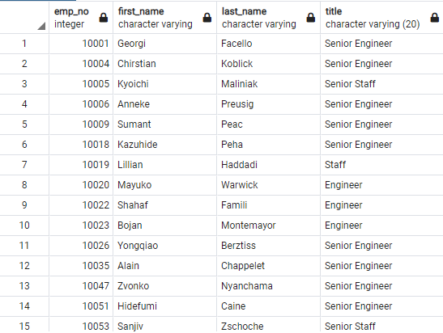

# Pewlett-Hackard-Analysis

## Overview
This an analysis of impending Pewlett-Hackard employee retirements, known as the "silver tsunami".

## Purpose
The purpose of this analysis is to gauge the impact of impending retirements and determine the feasibility of offering a mentorship program.

## Analysis

### Part 1, the Impact
We begin by determining which employees are approaching eligiblity for retirement. Filtering the list of employees by their birth date seems like a good place to start and provides us with the following results:

Upon closer inspection we can see that our list also includes employees that have already left the company, whether through retirement or other means. To narrow down our search we will run query to give us only currently employed employees that are approaching retirement.

Here we can see that several of the eligible employees have the same job title. To truly understand the impact let's determine how many employee will be eligible foir retirement by job title.

We can now see how the retirement of these employees will impact the company based on their job title.

### Part 2, The Mentorship Program
As a possible solution, a mentorship program staffed by eligible retiring employees has been suggested. The initial eligible demographic is employees that were born between January 1, 1965 and Decmber 31, 1965. Running our query based on this criteria provides the following result:

To better understand the opportunity this group would provide we need to quantify the list by job title.

When we compare this result with the number of eligible emlpoyees we can see how much additional need we would have to support the incoming employees.

The differenc in teh tab le above demonstrates that there will still be a significant need for mentors.

## Summary
